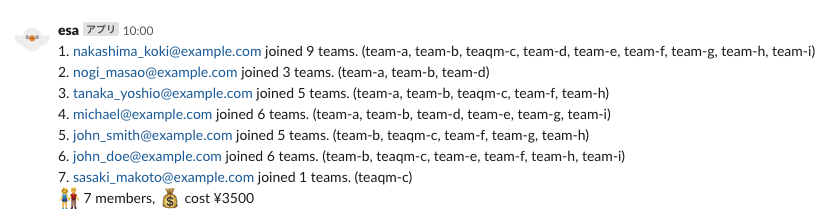

CDKサンプル
==========

esa.ioの利用状況をSlackへ出力するLambda をCDKで作るﾏﾝ

# Prerequirement

cdkがないと始まらない
```
npm install -g aws-cdk
```

# Setup

最初にデプロイ用のs3バケットを作ったりしないといけないので作る
```sh
cdk bootstrap
```

予め、SSM(Systems Manager)のパラメタストアに値を保存しておく
```sh
# (1) esa.ioのAPIトークンをSSMに保存する
aws ssm put-parameter \
    --type 'SecureString' \
    --name '/CDK/EsaStats2Slack/ESA_API_TOKEN' \
    --value 'klsjafdkl89kjfsdaklj_dfksa83_fdas3-asdfkljraw_sdva'

# (2) SlackのWebHookURLのトークンをSSMに保存する
aws ssm put-parameter \
    --cli-input-json '{"Name": "/CDK/EsaStats2Slack/SLACK_WEBHOOK_TOKEN", "Type": "SecureString",  "Value": "GSsfaadseeFTT/GDTgasdfga/fsdf2i2i", "Description": "Incomming Webhook token for hasigo.slack.com #esa"}'
```

# Deploy

```
cdk deploy
```

# Screenshot

毎月末のAM10:00に、Slackにesaの利用者と所属チームが出力される

